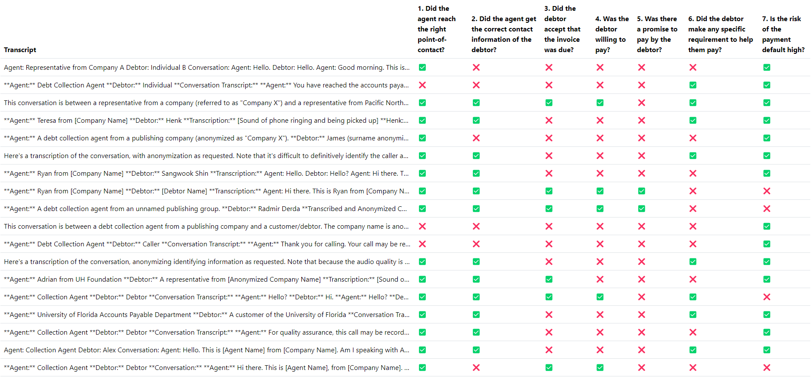

# Willingness to Pay

An interactive web application that helps users analyze call transcripts to assess customer willingness to pay.

## Features

- Analyzes call transcripts to assess customer willingness to pay
- Customizable system prompts and analysis criteria
- Dark/light theme support
- Interactive results table with detailed modal view
- Keyboard navigation support
- Secure authentication via LLM Foundry API
- Supports multiple transcript analysis in batch
- JSON schema validation for consistent responses

## Usage

1. Log in using your LLM Foundry credentials
2. Either use the default transcripts or enter your own:
   - Add transcripts separated by `==========`
   - Customize the system prompt if needed
   - Modify the analysis criteria (one per line)
3. Click "Analyze" to process the transcripts
4. View results in the interactive table:
   - ✅ indicates positive responses
   - ❌ indicates negative responses
   - Click any row to view detailed analysis
   - Use ↑/↓ keys to navigate between results

## Screenshot



## Installation

### Prerequisites

### Local Setup

1. Clone this repository:

```bash
git clone https://github.com/gramener/willingnesstopay.git
cd willingnesstopay
```

2. Serve the files using any static web server. For example, using Python:

```bash
python -m http.server
```

3. Open `http://localhost:8000` in your web browser

### Deployment

On [Cloudflare DNS](https://dash.cloudflare.com/2c483e1dd66869c9554c6949a2d17d96/straive.app/dns/records),
proxy CNAME `willingnesstopay.straive.app` to `gramener.github.io`.

On this repository's [page settings](https://github.com/gramener/willingnesstopay/settings/pages), set

- Source: `Deploy from a branch`
- Branch: `main`
- Folder: `/`

## Technical Details

### Architecture

The application follows a simple single-page architecture:

- Frontend-only implementation using vanilla JavaScript and ESM modules
- Streaming LLM responses for real-time analysis feedback
- Bootstrap for responsive UI components
- lit-html for efficient DOM updates
- JSON schema validation for API responses

### Dependencies

- [lit-html](https://www.npmjs.com/package/lit-html): Template rendering
- [asyncLLM](https://www.npmjs.com/package/asyncllm): Streaming LLM responses
- [partial-json](https://www.npmjs.com/package/partial-json): JSON parsing
- [Bootstrap](https://getbootstrap.com/): UI framework
- [Bootstrap Icons](https://icons.getbootstrap.com/): Icon set

The application uses the LLM Foundry API for:

- Authentication via token-based access
- GPT-4 powered transcript analysis
- Streaming response handling

## Development

### Project Structure

```
├── index.html # Main HTML file
├── script.js # Main application logic
├── style.css # Styling
└── README.md # Documentation
```

## License

[MIT](LICENSE)
